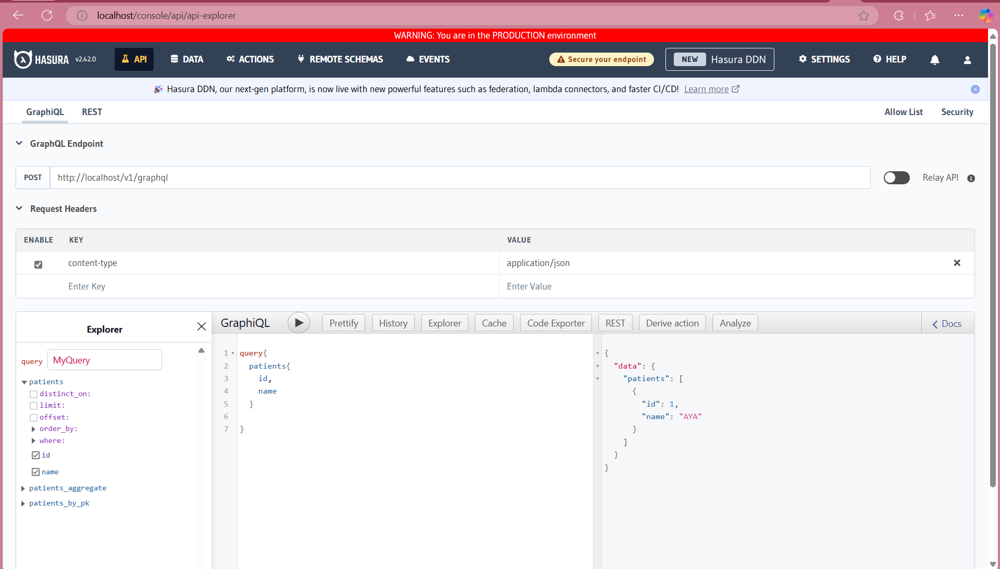

# Playground 1

Here we are going to explore the first solution, which is to use the reverse proxy NGINX to insert a banner to make the difference between the production page and the staging page. 

Notes about the solution:
- The solution is simple and easy to implement.
- The solution is not the best in terms of performance, but it is good for small projects.
- Having a self-hosted Hasura instance is a requirement, so you can use the NGINX reverse proxy to insert the banner.
- In this demo we're using Docker to run the Hasura instance and the NGINX reverse proxy. We will only simulate the production environment.

## Steps

1. Create a new directory and navigate to it.

```bash
mkdir playground1
cd playground1
```

2. Pull the docker images for Hasura 
[Hasura Docker](https://hasura.io/docs/2.0/getting-started/docker-simple/)

3. Go to the [docker-compose file](docker-compose.yml) and add the following configuration:

```yaml
 nginx:
    image: nginx:latest
    ports:
      - "80:80" 
    volumes:
      - ./nginx.conf:/etc/nginx/conf.d/default.conf
    depends_on:
      - graphql-engine
```

4. Create a new file called `nginx.conf` and add the following configuration:

```nginx
server {
    listen 80;

    location / {
        proxy_pass http://graphql-engine:8080; 
        proxy_set_header Host $host;
        proxy_set_header X-Real-IP $remote_addr;
        proxy_set_header X-Forwarded-For $proxy_add_x_forwarded_for;

        sub_filter '</body>' '<div style="position:fixed;top:0;width:100%;background-color:red;color:white;text-align:center;z-index:1000;">WARNING: You are in the PRODUCTION environment</div></body>';
        sub_filter_once off;
    }
}

```

Now ofc you can change the banner to whatever you want, and you can also change the color, the text, and the position of the banner, it's just an example with basic HTML and CSS.

5. Run the docker-compose file:

```bash
docker-compose up
```

6. Open your browser and navigate to `http://localhost` and you should see the banner.


