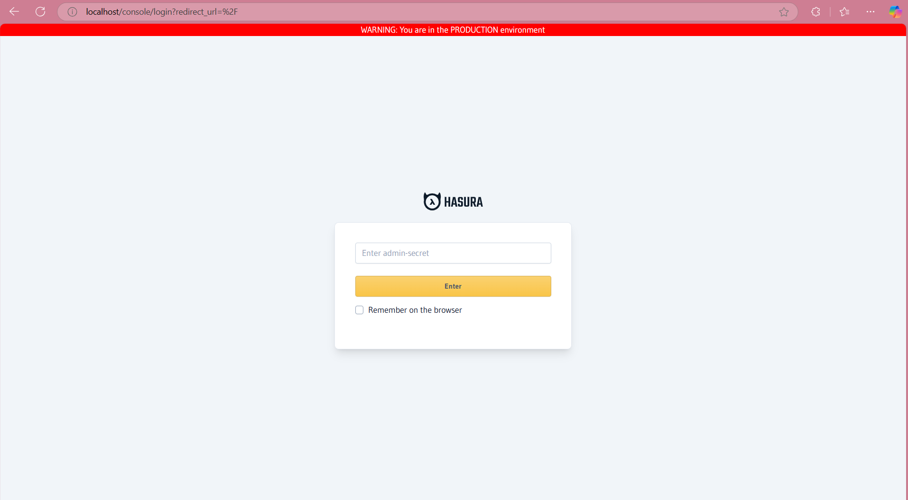
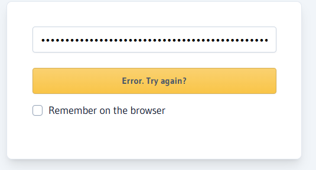

# Playground 2 : **Environment Separation Using Secrets**

#### **1. Environment-Specific Admin Secrets**
Hasura’s admin secret provides unrestricted access to the console. To enforce environment separation:
- Use distinct admin secrets for **staging** and **production**.
- Example:
  - Staging secret: `staging-secret`.
  - Production secret: `prod-secret`.

Admin secrets are typically generated as static values and stored securely. I'm just using a random one :
   ```bash
   node -e "console.log(require('crypto').randomBytes(32).toString('hex'))"
   ```
- stage e8c037c70e88b82ff02e5925ec96591c1a65fc93fbda6404c17539a68b96166a
- prod 9c366f760c5d77ba0d84973511bcbf8951d95dfa706b9ba2007e1f58628765b4

Note : I would recommend using a password manager to store these secrets securely. Azure Key Vault or AWS Secrets Manager are also good options.

2. Store the secret in environment variables for each environment:
   - **Staging**: `HASURA_GRAPHQL_ADMIN_SECRET=e8c037c70e88b82ff02e5925ec96591c1a65fc93fbda6404c17539a68b96166a`
   - **Production**: `HASURA_GRAPHQL_ADMIN_SECRET=9c366f760c5d77ba0d84973511bcbf8951d95dfa706b9ba2007e1f58628765b4`

Since I'm using Docker Compose, I'll add the secrets to the `docker-compose.yml` file:
   ```yaml
   graphql-engine:
     image: hasura/graphql-engine:v2.42.0
     environment:
       HASURA_GRAPHQL_ADMIN_SECRET: e8c037c70e88b82ff02e5925ec96591c1a65fc93fbda6404c17539a68b96166a
   ```

#### **How Secrets Are Used**
When a user connects to Hasura, their access depends on the secret they provide:
- If a **staging secret** is provided, the user gets full admin access to staging.
- If a **production secret** is provided, the user gets admin access to production (trusted users only).

If I enter the prod key in staging : 


---
[Back to the main README](../README.md)

[Navigate to Playground 3](../Playground3/README.md)