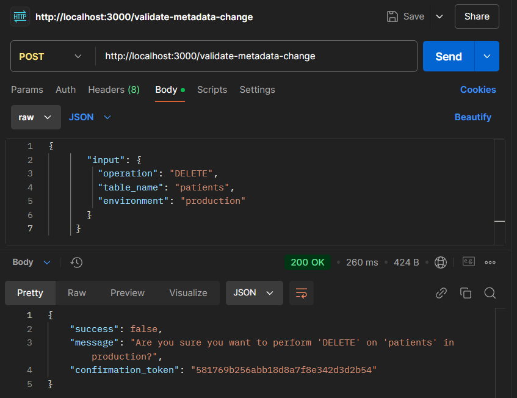
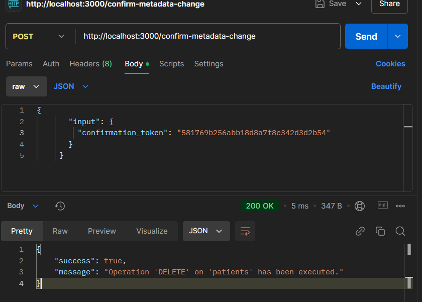
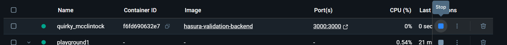
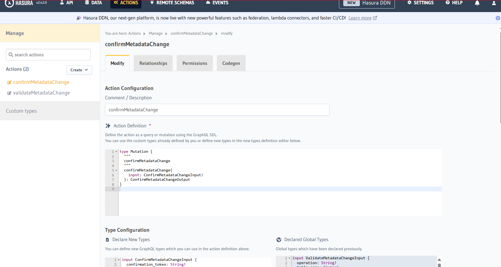
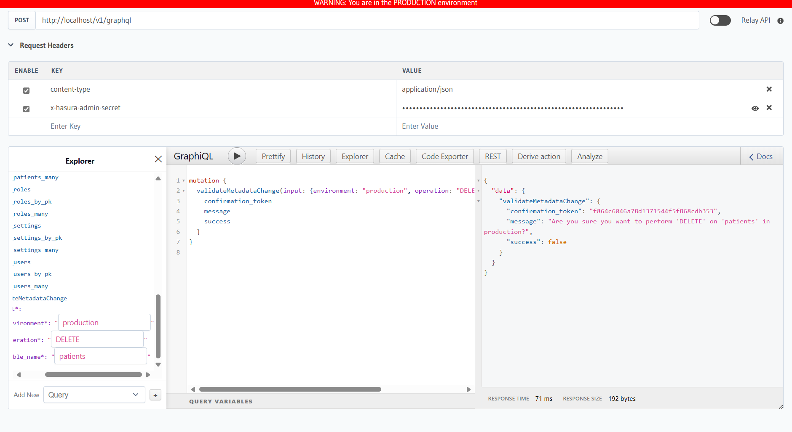
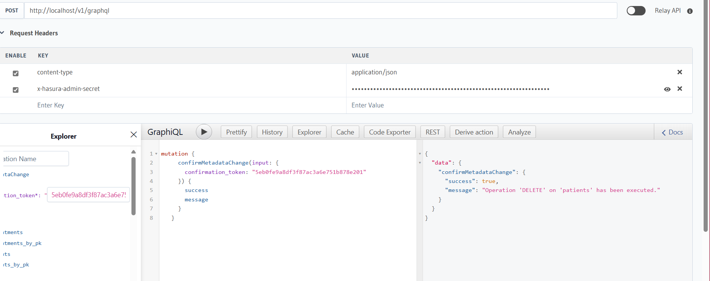
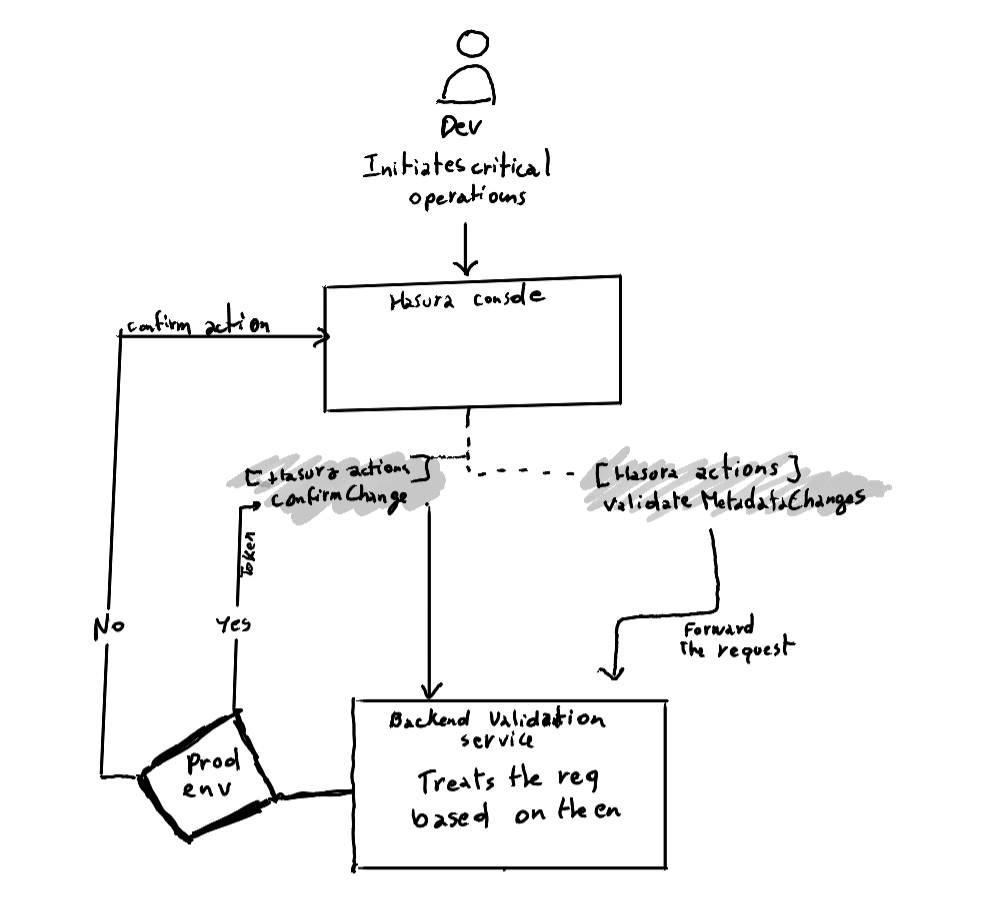

# Playground 3 : Hasura Actions and Backend Logic
Basically, Hasura Actions allow you to define custom business logic that can be invoked via a GraphQL query or mutation. We will use it to solve the prod vs. staging environment challenge.

What's expected from the backend is to validate the metadata change and request confirmation before executing the operation. We will use Node.js with Express for this.

Check the folder for the project.
   -  `hasura-validation-backend`.


2. Quick test of the operations we will be performing:

   - **Validate Metadata Change**:
    


   - **Confirm Metadata Change**:
    


---

We will run this project in a Docker container.



## Integrate with Hasura

1. In the Hasura console and we will create a new action for **Validate Metadata Change**:
   - **Action Name**: `validateMetadataChange`
   - **Input Type**:
     ```graphql
     input ValidateMetadataChangeInput {
       operation: String!
       table_name: String!
       environment: String!
     }
     ```
   - **Output Type**:
     ```graphql
     type ValidateMetadataChangeOutput {
       success: Boolean!
       message: String!
       confirmation_token: String
     }
     ```
   - **Webhook Handler**: `http://validation-backend:3000/validate-metadata-change`

3. Create another action for **Confirm Metadata Change**:
   - **Action Name**: `confirmMetadataChange`
   - **Input Type**:
     ```graphql
     input ConfirmMetadataChangeInput {
       confirmation_token: String!
     }
     ```
   - **Output Type**:
     ```graphql
     type ConfirmMetadataChangeOutput {
       success: Boolean!
       message: String!
     }
     ```
   - **Webhook Handler**: `http://validation-backend:3000/confirm-metadata-change`

   

---

Later on we can deploy the backend to any hosting provider.


Now we will test Hasura Console and use the `validateMetadataChange` action:
   - Input:
     ```graphql
     mutation {
       validateMetadataChange(input: {
         operation: "DELETE",
         table_name: "patients",
         environment: "production"
       }) {
         success
         message
         confirmation_token
       }
     }
     ```

Use the `confirmMetadataChange` action with the returned token:
   ```graphql
   mutation {
     confirmMetadataChange(input: {
       confirmation_token: "<token>"
     }) {
       success
       message
     }
   }
   ```




## How does this mess fits together in the grand scheme of the problem ?

Again a Recap of the Problem : The issue is that developers accessing the Hasura dashboard (console) for staging and production see the same interface, which can lead to accidental changes in the production environment.

| Environment | Behavior |
|-------------|----------|
| Staging     | - All critical actions are validated automatically. <br> - No confirmation token is required. |
| Production  | - All critical actions require an explicit confirmation step. <br> - Developers must confirm with a token. |

Visual representation of the flow:


---
[Back to Home](../README.md)
---
