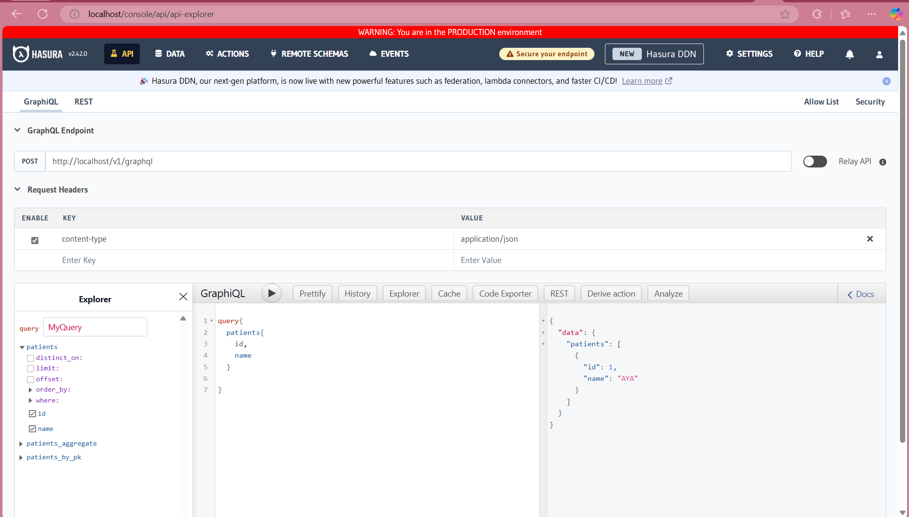
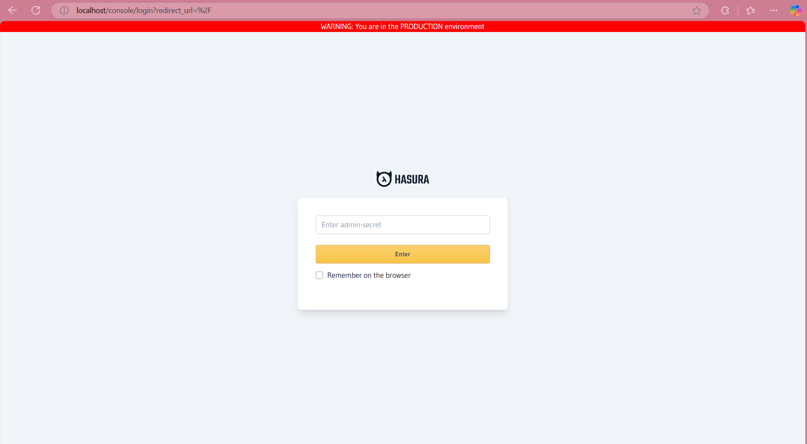
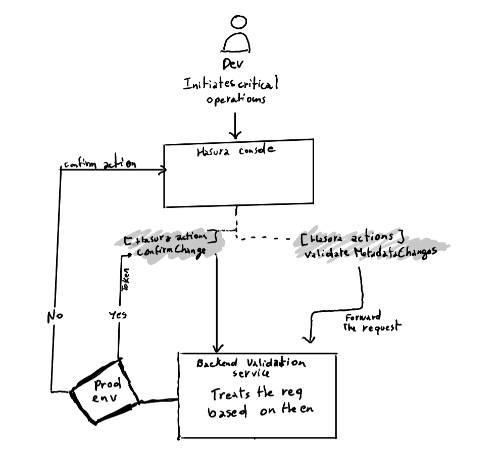

# rapidgoat-challenge
Contains my solutions and implementations for the technical challenge provided by RapidGoat. 

## Solution 1 : Reverse proxy to change the display
The first solution is to use the reverse proxy server to do a little twist on the display, so you can make the difference between the two environments.

- Check the steps here: [Solution 1](Playground1/README.md)

## Solution 2 : Environment separation using secrets
The second solution is to use environment-specific admin secrets to enforce environment separation. This way, you can ensure that only trusted users have access to the production environment.

- Check the steps here: [Solution 2](Playground2/README.md)

## Solution 3 : Create a validation backend and integrate wth Hasura Actions
The third solution is to create a validation backend and integrate it with Hasura Actions. This way, you can validate metadata changes before applying them to the database.

- Check the steps here: [Solution 3](Playground3/README.md)

## Which solution to choose?
The best solution depends on your specific requirements and constraints. 
- If you need a quick and simple solution, you can go with the first solution, however I expect you have self-hosted Hasura instances
- If you need more security and control over the environments, you can choose the second solution.
- If you need to validate metadata changes before applying them, and you have time to implement a more solid code, you can go with the third solution.

Budget, time and complexity are what you should consider when choosing the best solution for this use case.